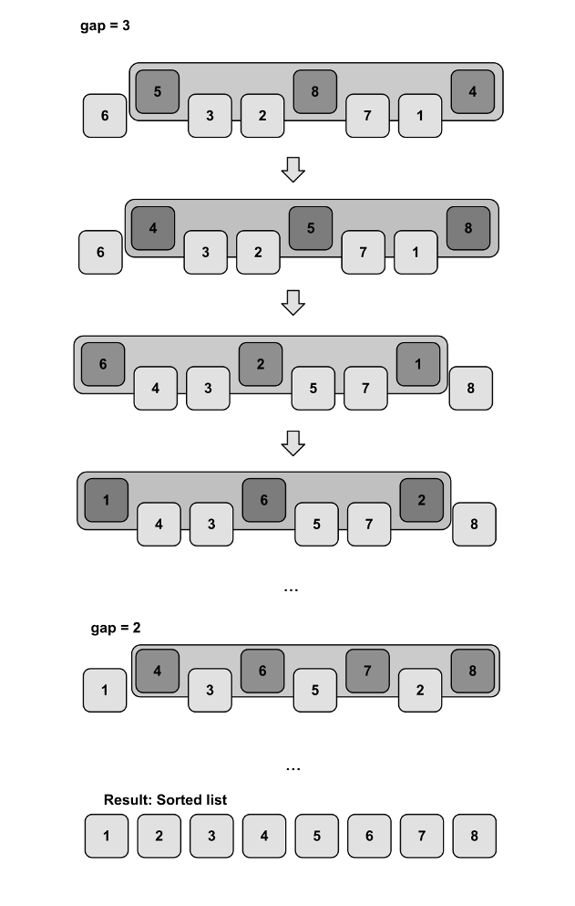

# Sorting-Algorithms

Sorting Algorithms in JavaScript
 + [Bubble sort](#bubbleSort)
 + [Selection Sort](#selectionSort)
 + [Insertion Sort](#insertionSort)
 + [Merge Sort](#mergeSort)
 + [Quick Sort](#quickSort)
 + [Shell Sort](#shellSort)
 + [Counting Sort](#сountingSort)

## Bubble sort

Первый метод сортировки называется пузырьковой сортировкой ***Bubble sort***, в рамках которой выполняются следующие действия: 
проход по файлу с обменом местами соседних элементов, нарушающих заданный порядок, до тех пор, пока файл не будет окончательно отсортирован. 

Основное достоинство пузырьковой сортировки заключается в том, что его легко реализовать в виде программы.

Для понимания и реализации этот алгоритм — простейший, но эффективен он лишь для небольших массивов. 

Суть алгоритма пузырьковой сортировки состоит в сравнении соседних элементов и их обмене, если они находятся не в надлежащем порядке.
Неоднократно выполняя это действие, мы заставляем наибольший элемент "всплывать" к концу массива.
Следующий проход приведет к всплыванию второго наибольшего элемента, и так до тех пор, пока после *n-1* итерации массив не будет полностью отсортирован.

> Сложность алгоритма: O(n2).

## Selection Sort

Сортировка выбором ***Selection Sort*** начинается с поиска наименьшего элемента в списке и обмена его с первым элементом 
(таким образом, наименьший элемент помещается в окончательную позицию в отсортированном массиве).
 
Затем мы сканируем массив, начиная со второго элемента, в поисках наименьшего среди оставшихся *n-1* элементов и обмениваем найденный наименьший элемент со вторым, 
т.е. помещаем второй наименьший элемент в окончательную позицию в отсортированном массиве. 

В общем случае, при i-ом проходе по списку *(0 &#8804; i &#8804; n-2)* алгоритм ищет наименьший элемент среди последних *n-i* элементов и обменивает его с *A[ i ]*. 
После выполнения *n-1* проходов список оказывается отсортирован.

> Сложность алгоритма: O(n2).

## Insertion Sort

На каждом шаге алгоритма сортировки встаками выбирается один из элементов входного массива и вставляется на нужную позицию в уже отсортированном массиве,
 до тех пор, пока входных элементы не будут исчерпана.
  
Метод выбора очередного элемента из исходного массива произволен; может использоваться практически любой алгоритм выбора. 

Обычно (и с целью получения устойчивого алгоритма сортировки), элементы вставляются по порядку их появления во входном массиве. 

В приведённой ниже реализации на JavaScript алгоритма сортировки встаками используется именно эта стратегия выбора.

> Сложность алгоритма: O(n2).

## Merge Sort

Сортировка слиянием использует подход «разделяй и властвуй» для сортировки элементов в массиве. 

По сути, это означает, что вместо работы с массивом в целом он непрерывно разбивает его на две части, 
пока обе половины не отсортированы, а затем половины объединяются в один решенный список.

> Сложность алгоритма: O(n log n).

## Quick Sort

> Сложность алгоритма: O(n2).

## Shell Sort

Shell Sort «сортировкой по убыванию», улучшает Insertion Sort, 
разбивая исходный массив на несколько меньших подмассивов, каждый из которых сортируется с использованием Insertion Sort. 
Способ выбора этих подмассивов - уникальность Shell Sort. Вместо того, чтобы разбивать массив на подмассивы смежных элементов, 
сортировка оболочки использует интервал *d*, иногда называемый интервал *gap*, для создания подмассива, выбирая все элементы, 
которые являются d-ми элементами, отдельно.
  
  + Самый простой пример *d = n / 2*, *d2 = d / 2 … dn = 1*.  ***O(n2)***
  + Предложение Хиббарда: проверить на всем ni — 1 <= n. ***O(n3/2)***
  + Числа Седжвика ...

> Сложность алгоритма: O(n2) или O(n3/2).

## Counting Sort

Вначале для каждого элемента массива подсчитывается количество элементов, меньших, чем он, и на основе этой 
информации текущий элемент помещается в соответствующее место отсортированного массива. 

> Сложность алгоритма: O(n2).

