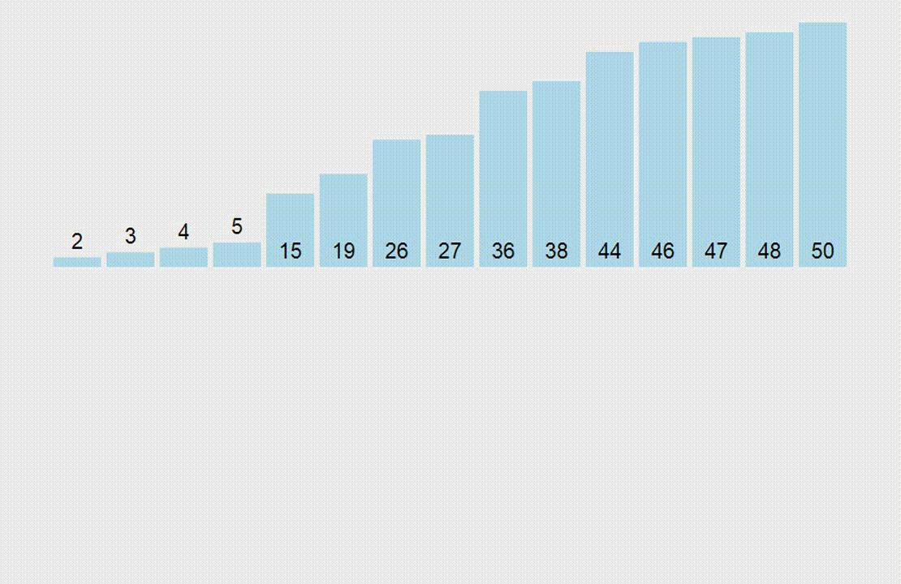

# Sorting-Algorithms

Sorting Algorithms in JavaScript
 + [Bubble sort](#bubbleSort)
 + [Selection Sort](#selectionSort)
 + [Merge Sort](#mergeSort)
 + [Insertion Sort](#insertionSort)

## Bubble sort

Первый метод сортировки называется пузырьковой сортировкой ***Bubble sort***, в рамках которой выполняются следующие действия: 
проход по файлу с обменом местами соседних элементов, нарушающих заданный порядок, до тех пор, пока файл не будет окончательно отсортирован. 

Основное достоинство пузырьковой сортировки заключается в том, что его легко реализовать в виде программы.

Для понимания и реализации этот алгоритм — простейший, но эффективен он лишь для небольших массивов. 

Суть алгоритма пузырьковой сортировки состоит в сравнении соседних элементов и их обмене, если они находятся не в надлежащем порядке.
Неоднократно выполняя это действие, мы заставляем наибольший элемент "всплывать" к концу массива.
Следующий проход приведет к всплыванию второго наибольшего элемента, и так до тех пор, пока после *n-1* итерации массив не будет полностью отсортирован.

> Сложность алгоритма: O(n2).

## Selection Sort

Сортировка выбором ***Selection Sort*** начинается с поиска наименьшего элемента в списке и обмена его с первым элементом 
(таким образом, наименьший элемент помещается в окончательную позицию в отсортированном массиве).
 
Затем мы сканируем массив, начиная со второго элемента, в поисках наименьшего среди оставшихся *n-1* элементов и обмениваем найденный наименьший элемент со вторым, 
т.е. помещаем второй наименьший элемент в окончательную позицию в отсортированном массиве. 

В общем случае, при i-ом проходе по списку *(0 &#8804; i &#8804; n-2)* алгоритм ищет наименьший элемент среди последних *n-i* элементов и обменивает его с *A[ i ]*. 
После выполнения *n-1* проходов список оказывается отсортирован.

> Сложность алгоритма: O(n2).

## Merge Sort

> Сложность алгоритма: O(n2).

## Insertion Sort